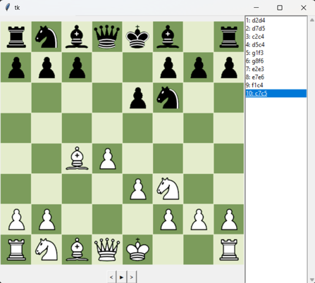
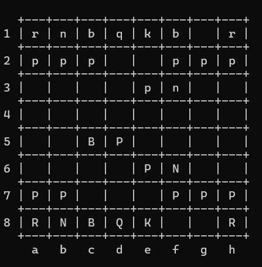

# Chess LAN Viewer





A lightweight Python utility designed for visualizing chess games recorded in Long Algebraic Notation (LAN). I originally created this small program as a debugging and testing tool to assist me while developing my own custom chess engine.

The project includes two distinct interfaces: a fully functional **Graphical User Interface (GUI)** and a lightweight **Command-Line Interface (CLI)**.

---

## What is Long Algebraic Notation (LAN)?

**LAN** is a straightforward chess notation method where each move is explicitly defined by its starting and ending coordinates: `<from_column><from_row><to_column><to_row>`.

**Examples:**
* `e2e4` – Pawn moves from e2 to e4
* `g1f3` – Knight moves from g1 to f3

> **Note:** A few sample games in LAN format are included in the repository for testing purposes.

---

## How to Run

The application is cross-platform and fully supports both **Linux** and **Windows**. 

### 1. GUI Version
Navigate to the GUI directory and run the script, passing the path to your LAN file as an argument:
```bash
cd gui_version
python main.py <path_to_input_file>
